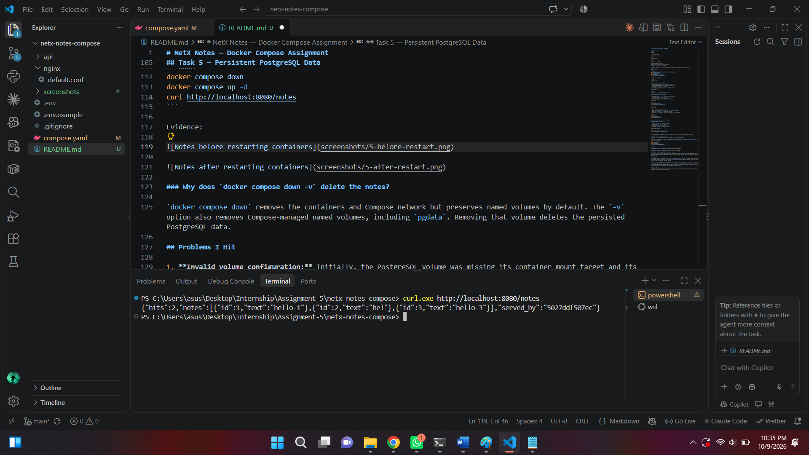
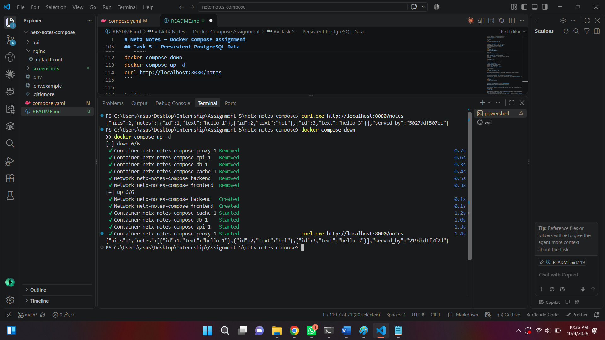

# NetX Notes — Docker Compose Assignment

## Architecture

```text
Browser
   |
   | localhost:8080
   v
Nginx Reverse Proxy (proxy)
   |
   v
Flask API (api)
   |              |
   v              v
PostgreSQL       Redis
  (db)          (cache)

frontend network: proxy, api
backend network: api, db, cache (internal)
PostgreSQL data: named volume pgdata
```

Only Nginx publishes a host port. The database and Redis are not directly exposed to the host.

## Quick Start

```bash
git clone https://github.com/amhar30/netx-notes-compose.git
cd netx-notes-compose
cp .env.example .env
docker compose up -d --build
curl http://localhost:8080/health
```

Expected health response:

```json
{"status":"ok"}
```

## Task 1 — Containerise the API

* Built the Flask API image using `python:3.12-slim`.
* Installed dependencies before copying application code.
* Configured a non-root user, `appuser`.
* Used Gunicorn instead of the Flask development server.
* Added `.dockerignore`.

Build command:

```bash
docker build -t netx-notes-api:task1 ./api
```

## Task 2 — Docker Compose and Nginx

* Defined the `proxy`, `api`, `db`, and `cache` services.
* Published only port `8080` on the host.
* Configured Nginx to forward requests to `api:5000`.
* Mounted the Nginx configuration as read-only.

Verification:

```bash
docker compose config -q
docker compose up -d --build
curl http://localhost:8080/health
```

"status":"ok"

## Task 3 — Configuration and Secrets

* Loaded database settings through `.env` and `${VAR}` references.
* Added `.env.example` with a placeholder password.
* Added `.env` to `.gitignore` so local credentials are not committed.

Verification:

```bash
git check-ignore -v .env
docker compose config -q
```

The actual `.env` file must not be committed.

## Task 4 — Network Isolation

* Created `frontend` and `backend` networks.
* Connected `proxy` only to `frontend`.
* Connected `api` to both networks.
* Connected `db` and `cache` only to `backend`.
* Configured `backend` with `internal: true`.

Verification commands:

```bash
docker compose exec proxy ping -c 1 db
docker compose exec api getent hosts db
```

The proxy should not be able to resolve `db`, while the API should resolve the database service name.

## Task 5 — Persistent PostgreSQL Data

PostgreSQL uses the named volume `pgdata`, mounted at `/var/lib/postgresql/data`.

Created notes through the API and verified that they remained available after running `docker compose down` followed by `docker compose up -d`.

```bash
docker compose down
docker compose up -d
curl http://localhost:8080/notes
```

Evidence:





### Why does `docker compose down -v` delete the notes?

`docker compose down` removes the containers and Compose network but preserves named volumes by default. The `-v` option also removes Compose-managed named volumes, including `pgdata`. Removing that volume deletes the persisted PostgreSQL data.

## Problems I Hit

1. **Invalid volume configuration:** Initially, the PostgreSQL volume was missing its container mount target and its top-level declaration. Fixed it by using `pgdata:/var/lib/postgresql/data` under the database service and declaring `pgdata:` under the top-level `volumes` section.

2. **HTTP 400 when posting JSON:** JSON requests sent through `curl.exe` in PowerShell returned `400 Bad Request`. Fixed the request by using `Invoke-RestMethod` with `ConvertTo-Json -Compress` to generate a valid JSON body.

3. **Initial API connection reset:** The first health request was sent immediately after starting the containers. Retrying after startup completed returned HTTP 200 and `{"status":"ok"}`.

## Tasks 6 and 7

Healthchecks, startup dependencies, service scaling, resource limits, and their verification evidence will be documented after those tasks are completed.
